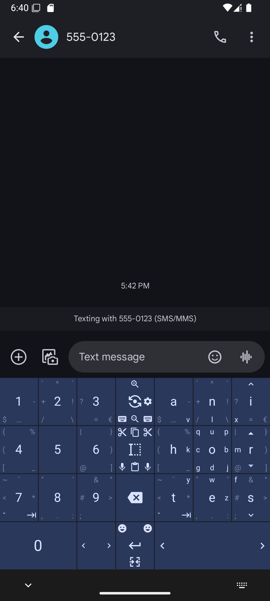
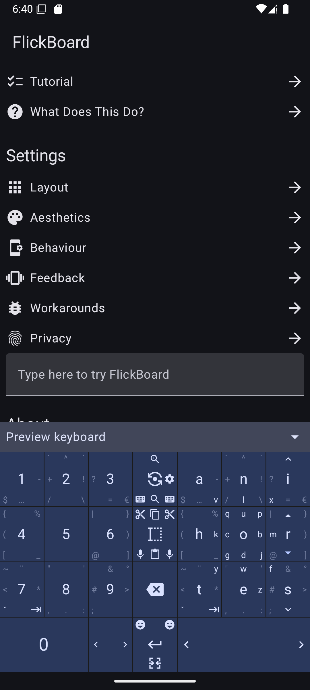

# FlickBoard

FlickBoard is a flicking-style keyboard, in the style of [MessagEase] and [Thumb-Key].

Type the letters in the center of a key by tapping it. Type the keys in the corners by swiping in
that direction. That's it!

## How do I install it?

| <a href="https://android.izzysoft.de/repo/apk/se.nullable.flickboard"></a> | <a href="https://play.google.com/store/apps/details?id=se.nullable.flickboard"></a> |
| - | - |

The latest release builds are also available from [GitHub Releases](https://github.com/nightkr/flickboard/releases), but I recommend downloading from one of the above instead to get automatic updates.

You can also build it yourself, by running the following on a computer that is connected to your
phone:

```bash
$ ./gradlew installDebug
```

This requires the phone to have USB debugging enabled, and your computer to have the [Android SDK]
installed.

## What does it look like?

|  |  |
| - | - |

## Why not MessagEase?

It's proprietary, and is currently threatening everyone's existing installations unless they
subscribe.

## Why not Thumb-Key?

Thumb-Key intentionally doesn't support some gestures that MessagEase supports.

[MessagEase]: https://www.exideas.com/ME/index.php

[Thumb-Key]: https://github.com/dessalines/thumb-key

[Android SDK]: https://developer.android.com/studio
